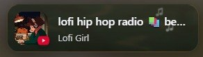

# Vivaldi Mini Media Dock

A compact media dock for Vivaldi's vertical tab bar, built around fast access to active media, artwork-aware styling, and a focused mini-player UI.

## Screenshots

| Preview | State | Description |
|---|---|---|
|  | **Compact view · playing** | Active playback with artwork, title, and source visible in a minimal footprint. |
|  | **Compact view · paused** | Paused media with quick track context preserved in the same lightweight layout. |

## What it does

- shows the current media item directly inside Vivaldi's vertical tab bar area
- keeps artwork, title, and source visible in a compact footprint
- supports playback controls, seeking, volume handling, and media cycling
- applies artwork-influenced theming to make the dock feel integrated with the current track
- includes richer behavior in the script for expanded controls and audio-reactive visuals

## Installation

If you already use Vivaldi UI modifications, add the script to your custom UI assets and reference it from `window.html`.

```html
<script src="vivaldi-mini-media-dock.js"></script>
```

If you are new to Vivaldi UI modding, start here first:

- <https://forum.vivaldi.net/topic/16684/inspecting-the-vivaldi-ui-with-devtools>

## Configuration

Most customization lives in the `SETTINGS` object near the top of `vivaldi-mini-media-dock.js`.

Example:

```js
const SETTINGS = {
  expandOn: "hover",
  visualizer: true,
  showMusicNotes: true,
  windowScopedMedia: false,
};
```

Some of the most useful settings are:

| Setting | Purpose |
|---|---|
| `expandOn` | Choose whether the dock expands on hover or click |
| `scrollGestures` | Enable wheel gestures for cycling media and changing volume |
| `visualizer` | Toggle the built-in visualizer behavior |
| `visualizerIntensity` | Control how dramatic the visual response becomes |
| `showMusicNotes` | Show or hide the floating note trail |
| `showPlaybackRate` | Display playback rate in the subtitle when not `1x` |
| `windowScopedMedia` | Restrict media items to the current Vivaldi window |
| `staleMinutes` | Automatically drop paused items after they sit idle |

## Compatibility notes

- designed primarily for Vivaldi with vertical tabs
- some DRM-protected or capture-restricted media may limit audio analysis behavior
- the compact dock remains useful even when advanced audio-reactive features are unavailable

## Credits

This project started from the original Global Media Controls Panel modification shared on the Vivaldi Forums and has since been heavily expanded and reworked.

Original thread:
- <https://forum.vivaldi.net/topic/66803/global-media-controls-panel>

## License

Apache License 2.0. See `LICENSE` for details.
